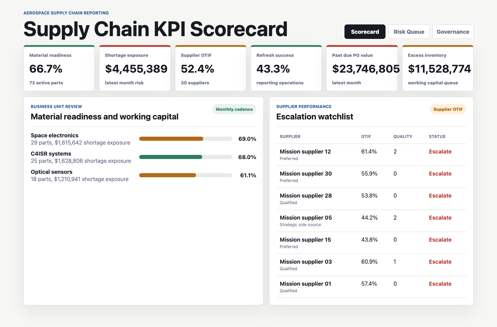
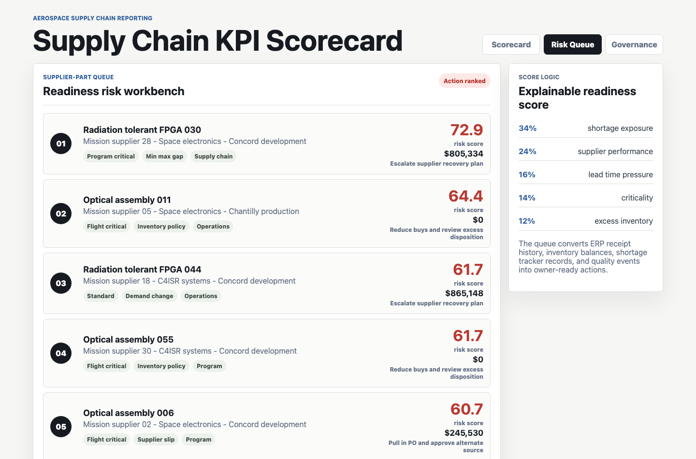
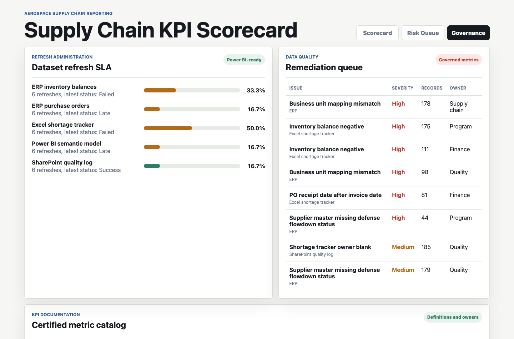

# Aerospace Supply Chain KPI Scorecard

This project is a governed BI reporting artifact for an aerospace and defense electronics manufacturer. It shows how a supply chain analyst can turn ERP purchase orders, inventory balances, Excel shortage trackers, SharePoint quality logs, refresh records, and KPI definitions into a recurring leadership scorecard.

The artifact is more than a dashboard. It includes a synthetic source-data model, a transparent readiness-risk scorecard, Power BI-style measure logic, SQL validation checks, data-quality queues, refresh governance, executive findings, and three distinct application surfaces.

## Screenshots



**Executive scorecard:** Summarizes material readiness, shortage exposure, supplier OTIF, refresh success, past-due PO value, and excess inventory. The lower panels show business-unit readiness and supplier escalation status for a recurring leadership review.



**Readiness risk workbench:** Ranks supplier-part combinations by shortage exposure, supplier performance, lead-time pressure, part criticality, and excess inventory. Each queue item includes a root cause, owner, modeled impact, and recommended action.



**Governance center:** Tracks dataset refresh SLA, high-impact data-quality issues, KPI definitions, business owners, and certification status so recurring reporting can be maintained and trusted.

## What This Demonstrates

- Supply chain KPI reporting across material readiness, supplier OTIF, past-due exposure, shortage exposure, inventory health, excess inventory, and refresh reliability.
- Repeatable data preparation from ERP-style, Excel-style, and SharePoint-style reporting sources.
- Transparent scorecard logic that can be explained to Supply Chain, Operations, Finance, Program, and Quality stakeholders.
- Power BI semantic-model thinking through a DAX measure catalog and governed KPI definitions.
- Data-quality and refresh administration controls that support weekly, monthly, quarterly, and ad hoc reporting cadences.
- Executive-ready communication through findings, screenshots, SQL checks, and owner-ready action queues.

## Data

The data is synthetic and generated by `scripts/score_operating_data.py`. It does not represent any real company, supplier, program, ERP system, inventory balance, or operating performance.

The synthetic structure is modeled on common aerospace supply chain reporting workflows:

- ERP purchase orders with ordered units, received units, promised lead time, actual lead time, late days, receipt status, and PO value.
- ERP inventory balances with on-hand units, allocated units, open demand, safety stock, shortage units, excess units, inventory value, and material readiness.
- Supplier and part master data with supplier tier, quality-system status, defense flowdown readiness, business unit, site, part class, unit cost, lead time, demand rate, lifecycle state, and criticality.
- Excel-style shortage tracker records with root cause, program need date, severity, owner, and mitigation status.
- SharePoint-style quality and governance logs with quality events, KPI definitions, data-quality issues, and refresh administration records.

Synthetic assumptions include long lead-time aerospace electronics components, sole-source and preferred suppliers, flight-critical and program-critical parts, quality holds, supplier slips, safety-stock policies, excess inventory thresholds, refresh SLA outcomes, and governed KPI certification.

## Model

The readiness risk score is an explainable scorecard:

`34% shortage exposure + 24% supplier performance + 16% lead time pressure + 14% criticality + 12% excess inventory pressure`

This is intentionally transparent instead of black-box predictive modeling. The role this artifact targets depends on trustworthy recurring BI, metric governance, stakeholder alignment, and defensible reporting logic.

## Repository Guide

- `index.html`: static multi-surface BI console.
- `src/app.js`: loads generated CSV and JSON outputs into the app.
- `src/styles.css`: responsive application styling.
- `scripts/score_operating_data.py`: deterministic data generation, scorecard logic, output tables, and documentation refresh.
- `data/`: synthetic source tables.
- `analysis/outputs/`: dashboard-ready scorecards, queues, summaries, and governance outputs.
- `analysis/dax_measure_catalog.md`: Power BI-style measures for the core KPI layer.
- `analysis/sql_checks.sql`: SQL examples for readiness, supplier performance, and refresh governance.
- `analysis/executive_findings.md`: stakeholder-ready interpretation.
- `data_dictionary.md`: table grains and purpose.

## Run Locally

```bash
npm run analyze
npm start
```

Then open `http://127.0.0.1:4187`.

## Scope

This project demonstrates supply chain BI, KPI governance, reporting automation, data quality review, and executive-ready analysis for an aerospace manufacturing context. It is not a production ERP integration, supplier management system, procurement workflow, financial control, or representation of real operational performance. A production implementation would require validated enterprise data, source-system access controls, security review, stakeholder signoff, and monitored refresh operations.
